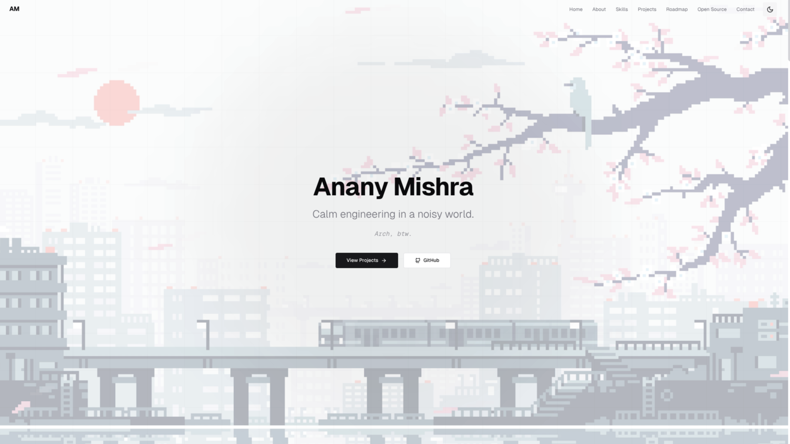

<div align="center">

<!-- Hero Banner -->


<br>

<!-- Typing Animation -->
<a href="https://git.io/typing-svg"></a>

<br><br>

<!-- Tagline -->
<samp>

**`Calm engineering in a noisy world.`**

</samp>

<br>

<!-- Social Badges -->
<a href="https://www.ananymishra.tech" target="_blank">
  
</a>
<a href="https://linkedin.com/in/ananymishradev" target="_blank">
  
</a>
<a href="https://github.com/ananymishradev" target="_blank">
  
</a>
<a href="mailto:anany.mishra.dev@gmail.com">
  
</a>

<br><br>

<!-- Quote Box -->
```text
💭 "I architect and build high-performance, scalable backend systems that power
    business-critical applications. From JVM optimization to distributed microservices,
    I deliver solutions that handle millions of requests while maintaining reliability."
```

<br>

</div>

---

<div align="center">

### `⚡ What I Do`

</div>

<table align="center">
<tr>
<td align="center" width="200">

<br><strong>Backend Engineering</strong>
<br><sub>Java • Spring Boot • Distributed Systems</sub>
</td>
<td align="center" width="200">

<br><strong>Systems Thinking</strong>
<br><sub>Understanding how components work together</sub>
</td>
<td align="center" width="200">

<br><strong>Performance Focus</strong>
<br><sub>JVM optimization & high-throughput systems</sub>
</td>
<td align="center" width="200">

<br><strong>Production Ready</strong>
<br><sub>Reliability • Observability • Testing</sub>
</td>
</tr>
</table>

---

<div align="center">

### `Tech Arsenal`

<br>

<!-- Tech Stack Icons -->


<br><br>

<!-- More specific badges -->


</div>

---

<div align="center">

### `Current Focus`

```yaml
Deep Diving Into:
  - JVM internals & performance optimization
  - Spring Boot & microservices architecture
  - Distributed systems & Apache Kafka
  - Observability & production readiness

Learning:
  - Data structures & algorithms (LeetCode)
  - System design patterns
  - Chaos engineering principles
```

</div>

---

<div align="center">

### `📈 GitHub Stats`


</div>

<div align="center">


<br><br>

<samp>

**⭐ If you find my work interesting, consider giving it a star!**

</samp>

<br>

<a href="https://www.ananymishra.tech" target="_blank">
  
</a>

<br><br>

<!-- Footer Wave -->


</div>

